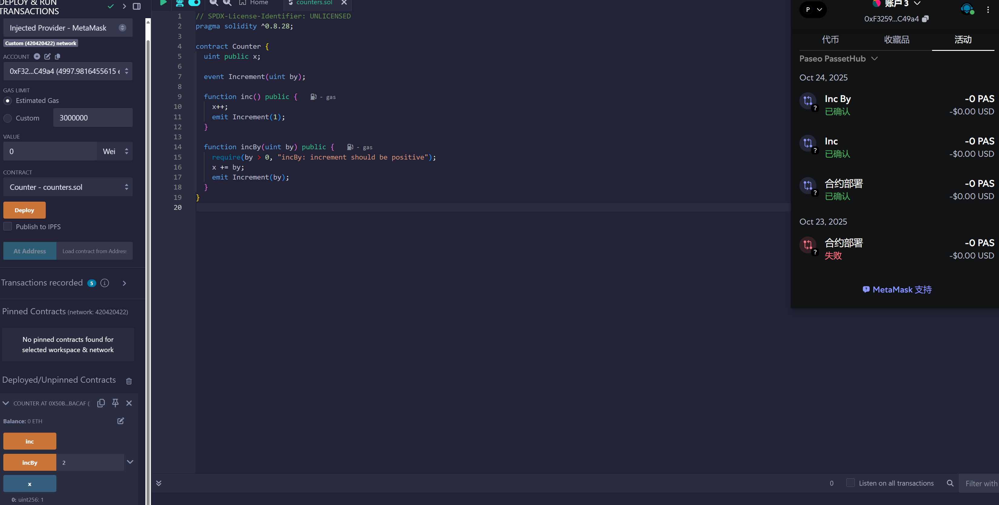

# Hardhat和Remix部署合约到Paseo_PassetHub

1. 创建项目

``` shell
# 初始化 hardhat 项目
pnpm dlx hardhat --init 
```
2. 配置hardhat.config.ts

hardhat.config.ts里的networks里添加如下配置(参考初始化时附带的配置)

``` typescript
    Paseo_PassetHub: {
      type: "http",
      chainType: "l1",
      url: configVariable("PASEO_PASSETHUB_RPC_URL"),
      accounts: [configVariable("PASEO_PASSETHUB_PRIVATE_KEY")],
    },
```

3. 配置 keystore

```shell
# 创建keystore
# 初次创建时，需要设置Keystore密码
# 后续set和get时，都需要输入密码才能执行后续操作
pnpm hardhat keystore set PASEO_PASSETHUB_RPC_URL
pnpm hardhat keystore set PASEO_PASSETHUB_PRIVATE_KEY
```

4. 部署合约

```shell
pnpm hardhat ignition deploy --network Paseo_PassetHub ./ignition/modules/Counter.ts
[hardhat-keystore] Enter the password: ********
✔ Confirm deploy to network Paseo_PassetHub (420420422)? … yes
Hardhat Ignition 🚀

Deploying [ CounterModule ]

Batch #1
  Executed CounterModule#Counter

Batch #2
  Executed CounterModule#Counter.incBy

[ CounterModule ] successfully deployed 🚀

Deployed Addresses

CounterModule#Counter - 0x072DfF8514A93aEaeebB8532c93C1Cb499c6dbc5
```

5. 测试合约

测试链上合约的代码是在scripts/ineractCounter.ts
使用的Hardhat的viem模块来调用测试链上的合约
但是vime调用Paseo_PassetHub时会报找不到该网络对应的ChainId，控制台错误如下

``` shell
pnpm hardhat run ./scripts/interactCounter.ts --network Paseo_PassetHub 
Nothing to compile
Nothing to compile

[hardhat-keystore] Enter the password: ********
HardhatError: HHE40000: No network with chain id "420420422" found.
```

错误原因根据单步调试跟踪的情况推测是
node_modules/.pnpm/@nomicfoundation+hardhat-viem@3.0.0_hardhat@3.0.7_viem@2.38.3_typescript@5.8.3_zod@3.25.76_/node_modules/@nomicfoundation/hardhat-viem/src/internal/chains.ts:54:13抛异常

原因是chains.ts:17行中的 chains 变量中的链集合是从 import * as chainsModule from "viem/chains"; 引入的，viem/chains/index.ts里看起来像是链白名单，Paseo_PassetHub没在白名单内，所以执行tests/interactCounter.ts时，会报找不到该网络对应的ChainId

6. Remix 部署和测试合约

