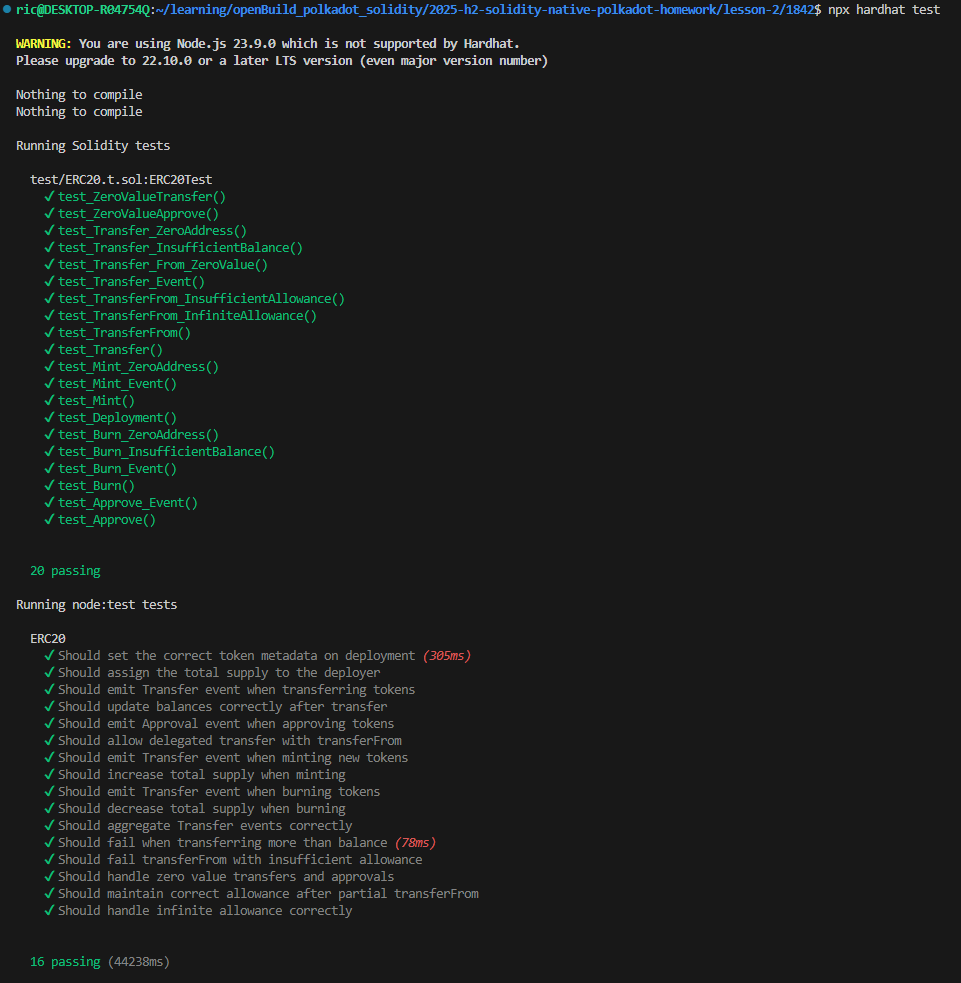

# Sample Hardhat 3 Beta Project (`node:test` and `viem`)

This project showcases a Hardhat 3 Beta project using the native Node.js test runner (`node:test`) and the `viem` library for Ethereum interactions.

To learn more about the Hardhat 3 Beta, please visit the [Getting Started guide](https://hardhat.org/docs/getting-started#getting-started-with-hardhat-3). To share your feedback, join our [Hardhat 3 Beta](https://hardhat.org/hardhat3-beta-telegram-group) Telegram group or [open an issue](https://github.com/NomicFoundation/hardhat/issues/new) in our GitHub issue tracker.

## Project Overview

This example project includes:

-   A simple Hardhat configuration file.
-   Foundry-compatible Solidity unit tests.
-   TypeScript integration tests using [`node:test`](nodejs.org/api/test.html), the new Node.js native test runner, and [`viem`](https://viem.sh/).

## Usage

### Running Tests

To run all the tests in the project, execute the following command:

```shell
npx hardhat test
```

You can also selectively run the Solidity or `node:test` tests:

```shell
npx hardhat test solidity
npx hardhat test nodejs
```

### Test Results


